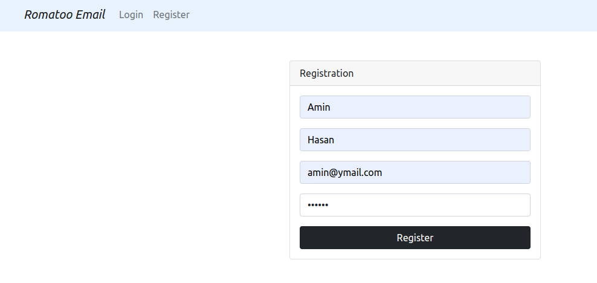
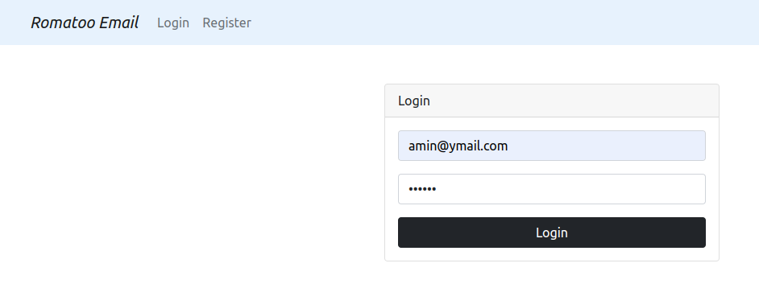
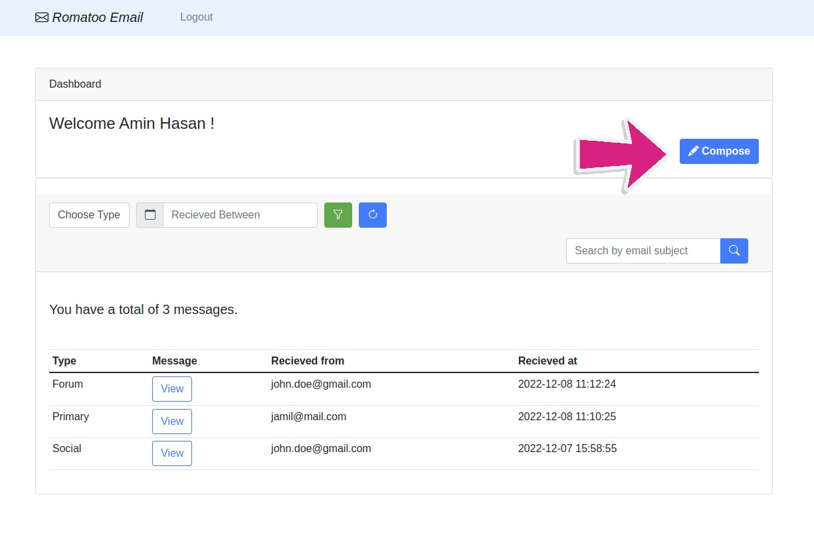
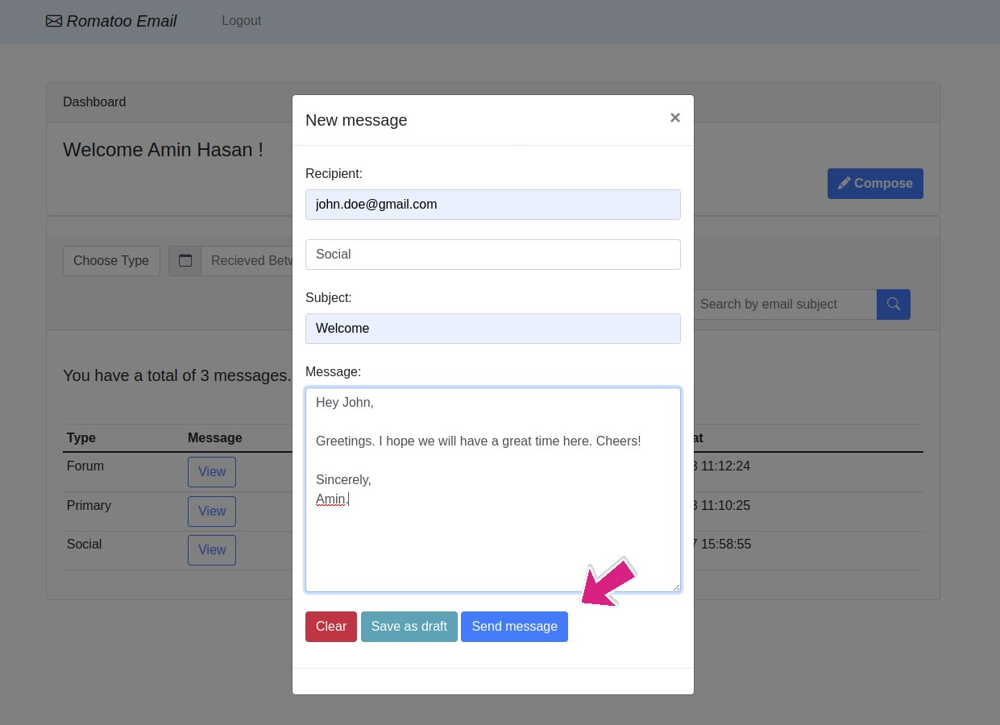
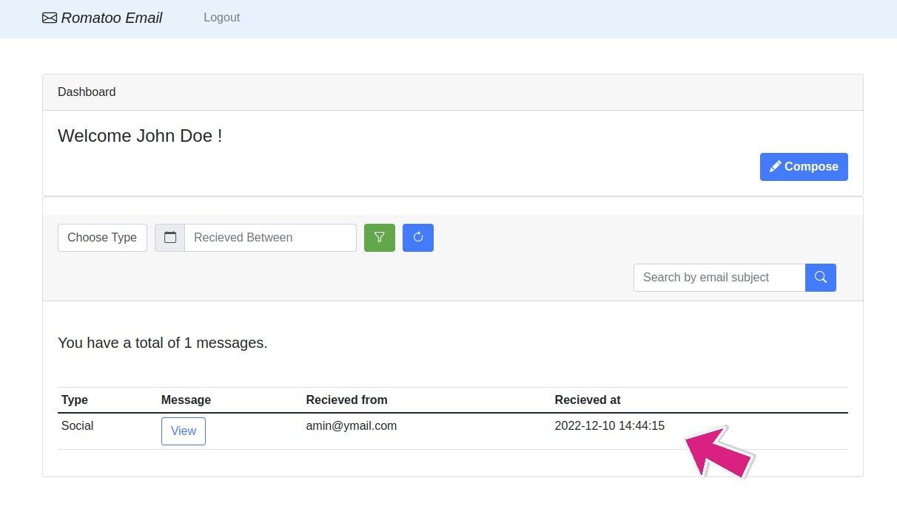
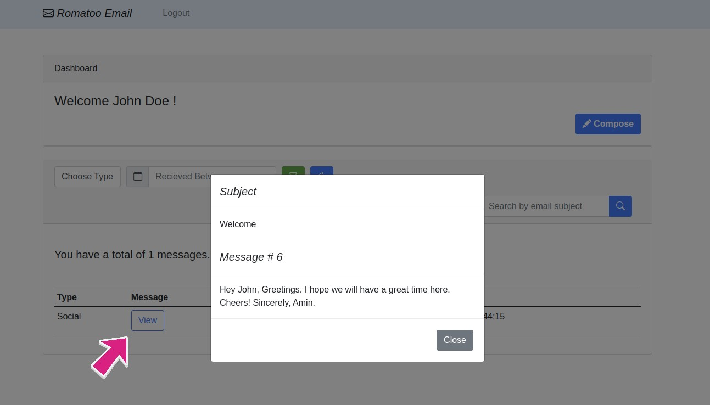
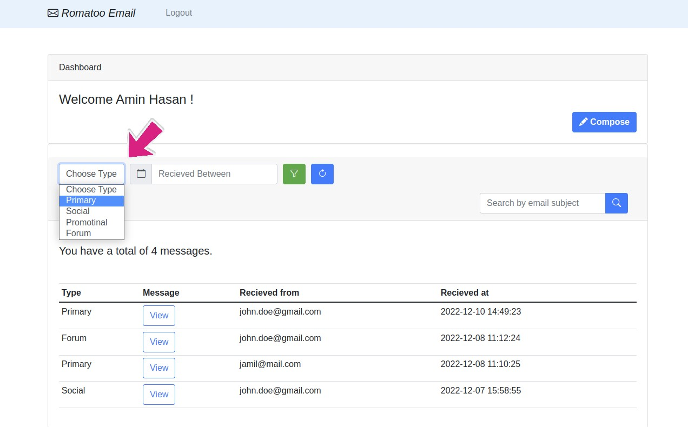
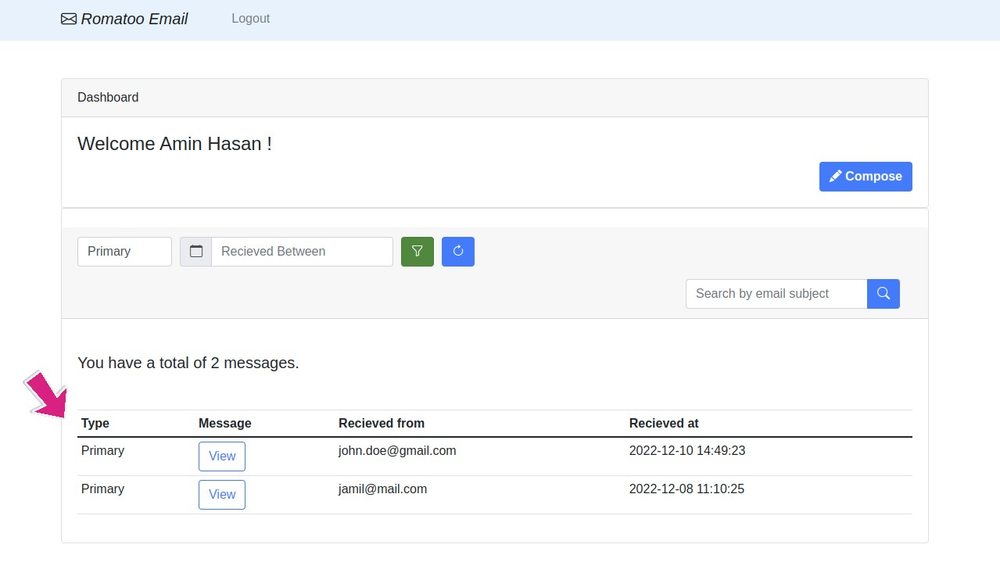

## About Project

It's basically a user to user mail messaging system. To send or recieve emails, the sender and reciever must have their credentials registered. After the registration, the user can login with their accounts. Once that is done, their personal dashboard will appear. 

### Note: The __src__ folder contains the project files.

## Local Device & OS

* [HP Pavilion 15](https://www.amazon.com/HP-Pavilion-Graphics-Compatible-15-cs3019nr/dp/B085B63QYR)
* [Ubuntu 20.04 LTS](https://linuxconfig.org/ubuntu-20-04-download)
## Installation and Tech Design

Here are the required components you need to install in your local machine to run this project. 

* [PHP 8](https://www.php.net/)
* [Composer](https://getcomposer.org/)
* [MySQL 8](https://www.mysql.com/)
* [Nginx](https://www.nginx.com)
* [Laravel 9](https://laravel.com/)
* [Docker](https://www.docker.com/)
* [Dockerfile with Alpine](https://hub.docker.com/_/alpine)
* [Docker Compose](https://www.digitalocean.com/community/tutorials/how-to-install-and-use-docker-compose-on-ubuntu-20-04)
* [Node 16](https://nodejs.org)
* [NPM 8](https://www.npmjs.com)

## Deployment

* Cloud Server: [Vercel](https://vercel.com/)

Hit the link to view the project : https://romato-u689p-fsh-98.vercel.app/login

 __***** Currently some fixes are going on with th URL *****.__ 
## Docker Services

Here are the list of services used on docker-compose.yml file.

* [PHP](https://hub.docker.com/_/php)
* [MySQL](https://hub.docker.com/_/mysql)
* [Nginx](https://hub.docker.com/_/nginx)
* [phpmyadmin](https://hub.docker.com/_/phpmyadmin)

## Docker commands

List of docker commands to run the project.

* Make a .env file on src folder & copy the contents of .env.example on .env file.
   ```sh
   cp .env.example .env
   ```
* Command to build & start all docker conatainers.
   ```sh
   docker-compose up -d --build
   ```
* Install composer on src folder.
   ```sh
   composer install
   ```
* For acessing php docker container, switch to src folder & run php.sh.
   ```sh
   ./php.sh
   ```
    * Provide permission to storage from src folder.
    ```sh
        chmod -R 777 storage/ 
    ```
    * Generate app key if .env file has none.
    ```sh
        php artisan key:generate
    ```
    * For table migration to database, run migration command.
    ```sh
        php artisan migrate
    ```
* Check running docker conatainers status.
   ```sh
   docker-compose ps
   ```
* Shutting down all running docker containers.
   ```sh
   docker-compose down
   ```

## Database Schema


## Requirements (Screenshot)

### R1: As a user, I want to sign up with my first name, last name, new email, and password.  The email address must be unique.

 

### R2: As a user, I want to sign in using my email address and password.

 

### R3: As a user, I want to send emails to another email address.

 

 

### R4: As a user, I want to receive emails from another email address.

 

 

### R5: As a user, I want to get emails in my inbox in four categories: Primary, Social, Promotional, and Forum. Email must be automatically categorized.
 
 

 