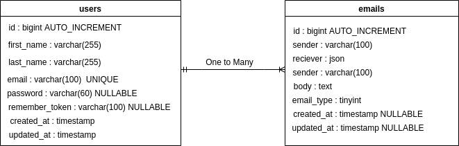

## Demonstration

* As a user, I want to sign up with my first name, last name, new email, and password. The email address must be unique.

 

* As a user, I want to sign in using my email address and password.

 

* As a user, I want to send emails to another email address.

 

 

* As a user, I want to receive emails from another email address.

 

 

* As a user, I want to get emails in my inbox in four categories: Primary, Social, Promotional, and Forum.
 
 

 

## Tech Stack

* [PHP 8](https://www.php.net/)
* [Composer](https://getcomposer.org/)
* [MySQL 8](https://www.mysql.com/)
* [Laravel 9](https://laravel.com/)
* [Docker](https://www.docker.com/)
* [Docker Compose](https://www.digitalocean.com/community/tutorials/how-to-install-and-use-docker-compose-on-ubuntu-20-04)
* [Node 16](https://nodejs.org)
* [NPM 8](https://www.npmjs.com)

## Docker Services

* [PHP](https://hub.docker.com/_/php)
* [MySQL](https://hub.docker.com/_/mysql)
* [Nginx](https://hub.docker.com/_/nginx)
* [phpmyadmin](https://hub.docker.com/_/phpmyadmin)

## Installation

* Run this to build the project.

   ```sh
   ./install.sh
   ```

## Database Schema


